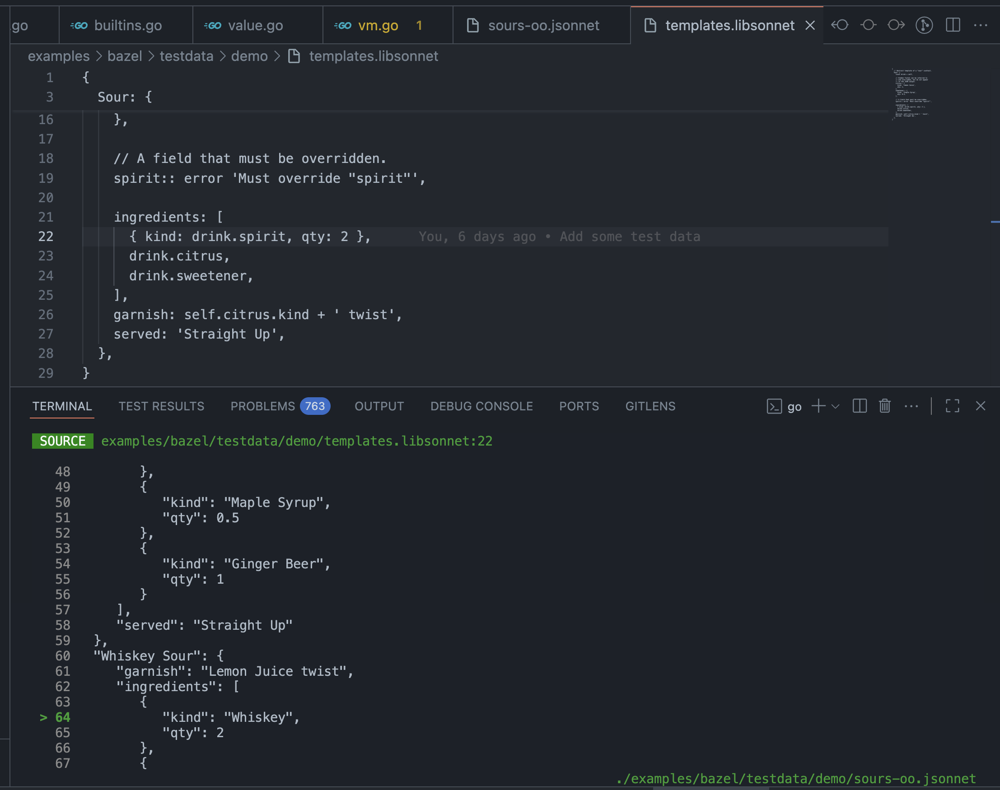

# jsonnet-tracer

This is a fork of http://github.com/google/go-jsonnet. In this fork I've added a command, `jsonnet-trace`, that helps to trace each property in the built JSON outcome back to its original input file location.

## Installation

```sh
$ go install github.com/y1hao/go-jsonnet/cmd/jsonnet-trace@latest
```

## Usage

```sh
$ jsonnet-trace <root_file.jsonnet>
```

For example

```sh
$ jsonnet-trace examples/bazel/testdata/demo/sours-oo.jsonnet
```
will build the `sours-oo.jsonnet` file (including its imports with relative paths), and will show the outcome json content as the following:



The original source file and line number where the property in the highlighted line is set or last modified is displayed on the top.
